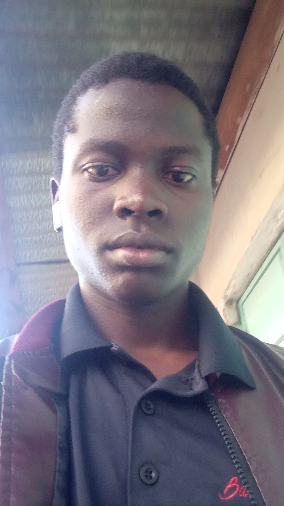

# Welcome to OseeLabs!

<caption>Name: Lazaro Osee</caption>

## About Me
Hi there! I'm __Lazaro Osee__, a passionate __Game Developer__, __Web Developer__, and __Architecture Student__ based in Kenya. 

I focus on creating innovative projects in _computer programming technologies_ and _game development_.

## Projects
**Here are some of the projects I'm currently working on:**

- **[Personal Github Website](https://oseelabs.github.io)**
     *Website for oseeLabs.*

## Skills
- **Programming Languages**:
    - [x] **JavaScript**
    - [x] **Python**
    - [x] **C#**
    - [x] **GDScript**
#####
- **Frameworks & Technologies**:
    - [x] **Godot**
    - [x] **Vue.js**
    - [x] **Node.js** 
    - [x] **Unity**
#####
- **Tools**:
    - [x] **Git**
    - [x] **Vite**
    - [x] **Markdown**
###

## Contact
Feel free to reach out to me via email at [info.stingerdevelopers@gmail.com](mailto:info.stingerdevelopers@gmail.com) 
or connect with me on [YouTube](https://www.youtube.com/@lazosee).

## Let's Collaborate!
I'm open to sponsorships and collaboration on open-source projects. If you share similar interests or have any ideas, let's connect!

**Thanks for visiting my profile!**

